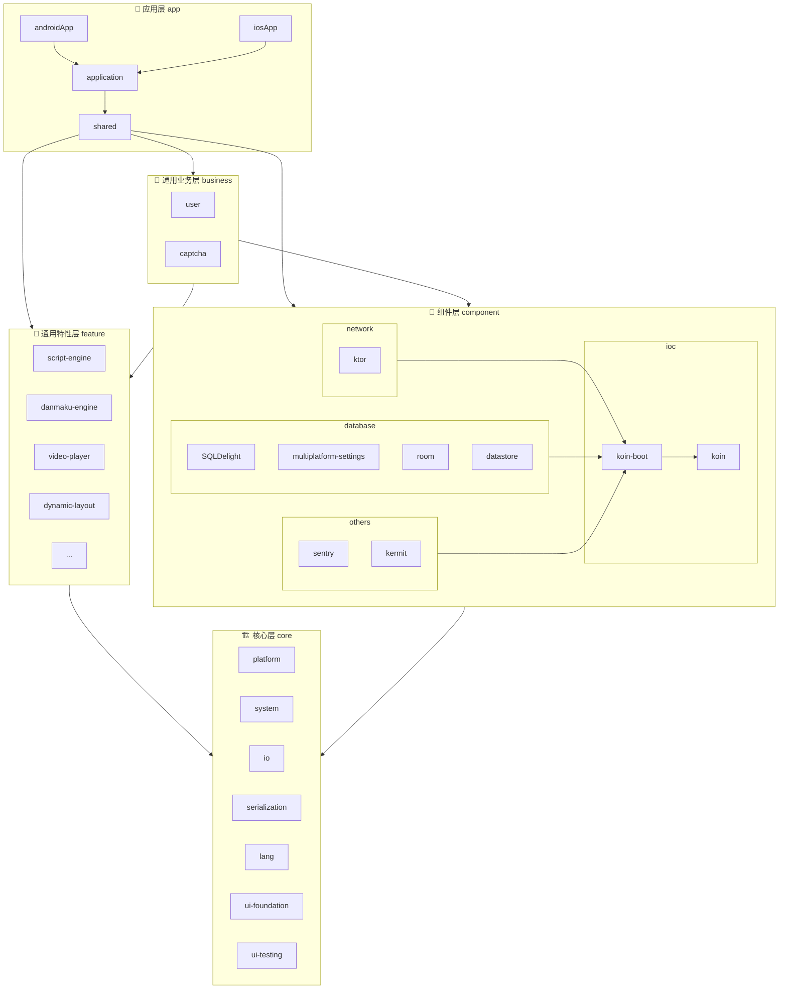

## **Kotlin Multiplatform 快速开发脚手架 - 架构设计方案**

### 1. 总体架构设计 (Overall Architecture Design)

本架构旨在构建一个高度模块化、可扩展、易于维护的Kotlin Multiplatform (KMP) 应用脚手架。其核心思想是*
*关注点分离 (Separation
of Concerns)** 和 **依赖倒置 (Dependency Inversion)**。

- **分层结构**: 架构采用金字塔形的四层结构，从下至上依次为 `core`, `component`, `feature`, `business`
  和 `app`
  。上层模块可以依赖下层模块，但反之不行，确保了单向的依赖关系，使得整个系统结构清晰、稳定。
- **模块化**: 每个模块都有明确的职责边界。
    - `core`: 提供最基础、与业务完全无关的能力。
    - `component`: 封装第三方库，提供即插即用的“组件”。
    - `feature`: 封装可复用的“业务能力集”。
    - `business`: 封装可复用的“技术能力”。
    - `app`: 整合所有模块，构建最终的、面向用户的应用程序。
- **跨平台与UI**: 使用 Kotlin Multiplatform 技术共享非UI的业务逻辑和基础能力，使用 Compose
  Multiplatform
  构建跨平台的声明式UI，最大限度地复用代码。

### 2. 架构图 (Architecture Diagram)

**图解**:

- **箭头方向**: 代表依赖关系。例如 `app` -> `feature` 表示 `app` 模块依赖 `feature` 模块。
- **层级关系**: `app` 在最顶层，`core` 在最底层，清晰地展示了依赖的流动方向。
- **内部依赖**: `component` 层内部的模块（如 `ktor`, `room`）依赖于 `koin-boot`，以实现依赖的自动注册。

## 3. 模块职责详解

### **`core` 模块 (🏗️ 核心层)**

此模块是整个架构的基石，提供与具体业务和第三方库无关的通用能力和抽象。

- **`platform`**: 定义平台相关的期望声明 (`expect`)
  。例如，获取应用上下文、设备信息、屏幕尺寸等。具体的平台实现 (`actual`)
  分布在各个平台的 `sourceSet` 中。
- **`system`**: 封装对系统级API的调用，如振动、亮度调节、相册图片存取等。同样使用 `expect/actual` 机制。
- **`io`**: 提供统一的文件操作API，抽象不同平台的文件路径（如缓存目录、数据目录）。
- **`serialization`**: 封装 `kotlinx.serialization`，提供通用的 `Json` 实例或序列化/反序列化帮助类。
- **`lang`**: 存放语言级别的工具类，如协程作用域封装、自定义的 `Result` 类、扩展函数等。
- **`ui-foundation`**: 存放Compose UI的基础元素，如无状态的基础组件（如自定义`Card`、`Button`
  的样式变体）、自定义导航、分页、基础的主题
  `Theme`框架。
- **`ui-testing`**: 提供UI测试的基类、规则（Rules）、和帮助函数，简化测试代码的编写。

### **`component` 模块 (🧩 组件层)**

此模块负责封装和适配第三方库，将具体实现细节与上层业务逻辑解耦。提供第三方库相关组件的配置与注入，每个子模块都是一个独立的"
即插即用"组件。

#### **`ioc` (依赖注入组件)**

- **`koin-boot`**: **核心设计**。此模块提供一套机制，让其他组件能够"自我声明"其提供的依赖。例如，定义一个
  `KoinBootInitializer`函数实例，其他组件模块（如 `network`）实现这个接口来提供自己的 `Koin Module`。这使得
  `app`
  模块在组装依赖时，可以自动发现并加载所有组件提供的依赖，类似于Spring Boot的自动配置。
- **`koin`**: 基于 Koin 的依赖注入容器配置，提供核心的DI功能。

#### **`network` (网络组件)**

- 依赖 `koin-boot` 和 `core` (为了序列化)。
- **`ktor`**: 基于 Ktor 封装一个统一的 `HttpClient`，处理通用逻辑，如添加 `header`、日志拦截、`Token`
  刷新、错误处理等。
- 通过 `koin-boot` 将 `HttpClient` 实例注入到 DI 容器中。

#### **`database` (数据库组件)**

- **`SQLDelight`**: 封装对 SQLDelight 的支持。
- **`room`**: 封装对 Room 的支持。
- **`multiplatform-settings`**: 封装 `key-value` 存储，提供一个简洁的接口用于读写用户偏好设置等。
- **`datastore`**: 封装 `androidx.datastore`，提供类型安全的数据存储能力，支持 `kotlinx-serialization`
  序列化复杂数据结构。
- 同样，这些模块都会利用 `koin-boot` 将自己提供的数据库实例、DAO、`Settings` 或 `DataStore` 实例注册到
  DI 容器。

#### **`others` (其他组件)**

- **`sentry`**: 错误监控和崩溃报告组件，封装 Sentry SDK 的配置和使用。
- **`kermit`**: 日志记录组件，提供跨平台的日志记录能力。

### **`feature` 模块 (🧰 通用特性层)**

可复用的**技术能力**（与具体业务无关，如:播放器、弹幕引擎、动态布局） ，一个`feature`
模块代表一个垂直的特性领域，通常包含自研或开源的轮子框架/工具。

- **`danmaku-engine`**: 弹幕引擎特性模块
    - 提供弹幕的定义、解析、渲染功能
    - 支持多种弹幕格式和渲染效果
    - 与具体的视频播放器解耦，可独立使用

- **`video-player`**: 视频播放器特性模块
    - 提供视频播放控制与渲染功能
    - 支持多种视频格式和播放控制
    - 可与弹幕引擎集成使用

- **`dynamic-layout`**: 动态布局特性模块
    - 提供动态UI布局的解析和渲染能力
    - 支持服务端配置的UI布局
    - 可用于实现灵活的页面配置

### **`business` 模块 (‍💼 业务中间层)**

可复用的**业务能力**（含领域模型、API、数据持久化） | 用户中心、会员体系、皮肤系统 |

### **`app` 模块 (📱 应用层)**

这是最终面向用户的应用程序，是所有下层模块的整合者和消费者。

#### **总结**

- `core` 来实现系统功能（调节亮度/声音等）
- `component` 来自动注入与配置Http客户端数据库等
- `feature` 实现播放器与弹幕的UI和控制逻辑
- `business` 使用Http客户端访问业务服务器获取视频数据
- `app` 模块作为最终的消费者，绘制具体的UI与编排具体的业务逻辑

#### **平台应用入口**

- **`androidApp`**: Android平台应用入口
    - 负责初始化Android相关的服务、创建`Activity`
    - 启动`shared`模块中的共享UI
    - 调用`application`模块的初始化流程

- **`iosApp`**: iOS平台应用入口
    - 负责初始化iOS相关的服务、创建`ViewController`
    - 启动`shared`模块中的共享UI
    - 调用`application`模块的初始化流程

#### **应用框架层**

- **`application`**: 应用层基础设施，用于对外暴露（例如打包成cocoapods的framework）
    - **依赖注入配置**: 整个依赖注入图的组装点。负责启动`Koin`，并加载所有`feature`和`component`模块（通过
      `koin-boot`机制）的依赖
    - **系统服务注册与管理**: 负责初始化和管理应用级别的服务，如推送服务、分析服务、崩溃报告等
    - **应用配置管理**: 负责管理应用的各种配置项，如API端点、功能开关等
    - **应用生命周期管理**: 负责协调应用的启动、前后台切换、终止等生命周期事件

#### **业务应用层**

- **`shared`**: 跨平台的应用业务与页面代码
    - `commonMain`: 绝大部分业务代码所在地
        - **`presentation`**: UI 层。包含 Compose `Screen`、`UiState/UiEvent/Action/Effect` 与对应的
          `ViewModel`。
            - `Screen` 只负责渲染与事件分发，不直连 `Repository/Api/Dao`。
            - `ViewModel` 不处理业务逻辑：只调用 `UseCase` 并更新 `UiState/Effect`。
            - 当需要持续监听数据变化（例如数据库/偏好设置的 `Flow`）时，ViewModel 也应订阅
              `ObserveXxxUseCase` 暴露的 `Flow`，而不是直接订阅 `Repository/Dao`。
        - **`domain`**: 业务编排层。包含 `UseCase`、校验器（`Validator`）以及领域模型与场景错误。
            - `UseCase` 面向“一次用户交互/一次业务意图”进行编排；`ObserveXxxUseCase` 用于对外暴露可订阅的
              `Flow`。
            - 在 Domain 层将 Data 层返回的通用错误 `DomainError`映射为场景错误，并对未知错误做
              `Unknown` 兜底，保证 Presentation 只消费场景错误。
        - **`data`**: 数据实现层。包含 `Repository` 实现与各类数据源（网络/数据库/缓存/本地设置等），负责具体的数据拉取与存储策略并隐藏实现细节。

      > 分层与错误处理的权威约定请参考：@.docs/contributing/layered.md
      >
      > 推荐调用链：
      `Screen → ViewModel → UseCase/ObserveXxxUseCase → Repository(接口) → RepositoryImpl/数据源`
    - `androidMain` & `iosMain`: 存放少量无法在`commonMain`中共享的平台特定UI或逻辑

### **依赖关系优化**

根据新架构图，依赖关系更加清晰：

1. **严格的层级依赖**:
    - `app` → `feature`, `component`, `business`
    - `business` → `feature`, `component`
    - `feature` → `core`
    - `component` → `core`
    - `core` → (无外部依赖)

2. **组件内部依赖**:
    - `component` 层的各个模块 (`network`, `database`, `others`) 都依赖于 `ioc/koin-boot`
    - `koin-boot` 依赖于 `koin`
    - 实现了组件的自动发现和注册机制

3. **应用层内部依赖**:
    - `androidApp` 和 `iosApp` 依赖于 `application`
    - `application` 依赖于 `shared`
    - `shared` 依赖于所有下层模块
