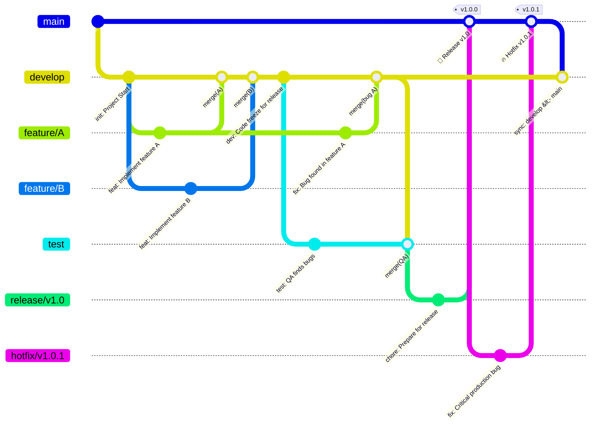

# 代码提交与版本

## 代码提交

- 格式：`类型(范围): 描述 \n 详细描述` ,如:

```markdown
fix(video): 修复弹幕速度设置逻辑
- 将弹幕速度的最小值从 50 调整为 13
- 相应地修改了速度计算公式，确保速度范围正确
```

- 类型：feat, fix, docs, style, refactor, perf, test, chore
    * feat：提交新功能
    * fix：修复了bug
    * docs：只修改了文档
    * style：调整代码格式，未修改代码逻辑（比如修改空格、格式化、缺少分号等）
    * refactor：非构建类代码重构，既没修复bug也没有添加新功能
    * perf：性能优化，提高性能的代码更改
    * test：添加或修改代码测试
    * chore：对构建流程或构建工具(gradle, .gradle.kts文件)和依赖库(libs.versions.toml)的更改
- 范围：受影响的模块
- 描述：使用现在时态，简明扼要

## 版本控制

### 分支管理

#### 主分支 (Main)

- **用途**: 生产环境代码，始终保持稳定可发布状态
- **命名**: `master` 或 `main`
- **保护策略**: 禁止直接推送，只能通过Pull Request合并
- **生命周期**: 永久存在

#### 开发分支 (Develop)

- **用途**: 集成最新开发功能的分支
- **命名**: `develop`
- **保护策略**: 禁止直接推送，通过Pull Request合并
- **生命周期**: 永久存在

#### 功能分支 (Feature)

- **用途**: 开发新功能或特性
- **命名规范**: `feature/功能描述_创建时间` 或 `feature/JIRA-123-功能描述_创建时间`
- **示例**:
    - `feature/user-authentication_20250714`
    - `feature/PROJ-456-payment-gateway_20250714`

- **生命周期**: 合并到 `Develop` 分支后，开发完成后存档一定时间后删除

#### 测试分支 (Test)

- **用途**: 添加新的测试或重构现有测试，例如单元测试、UI测试等。
- **命名规范**: `test/模块_测试描述_测试时间`
- **示例**:
    - `test/video-player_viewmodel_20250725`
    - `test/danmaku_ui_refactor_20250725`
- **生命周期**: 发布完成后删除存档一定时间后删除。

#### 发布分支 (Release)

- **用途**: 准备新版本发布，进行最后的bug修复
- **命名规范**: `release/版本号_发布时间`
- **示例**: `release/v1.2.0_2025071412`
- **生命周期**: 发布完成后删除存档一定时间后删除

#### 热修复分支 (Hotfix)

- **用途**: 紧急修复生产环境问题
- **命名规范**: `hotfix/版本号_创建时间` 或 `hotfix/问题描述_创建时间`
- **示例**:
    - `hotfix/v1.1.1_时间`
    - `hotfix/critical-security-patch_20250714`

- **生命周期**: 修复完成后删除存档一定时间后删除

### 命名约定

- 使用小写字母和'_'连字符
- 避免使用空格和特殊字符
- 保持描述性和简洁性

## 分支生命周期流程图



### 流程图说明

- main 分支: 所有发布版本的基线，保持绝对稳定。每个版本发布时都会在该分支上打上标签 (Tag)，例如 v1.2.0。
- develop 分支: 日常开发的主分支，集成了所有已完成的功能和修复。
- feature/* 分支: 从 develop 分支创建，用于开发新功能。开发完成后，合并回 develop 分支。
- test/* 分支: 从 develop 分支创建，用于测试代码不提交新代码。它会在发布阶段合并到 release 分支中。
- release/* 分支: 在准备发布新版本时，从 test 分支创建。此分支用于进行最后多个test分支的合并与最终测试。测试通过后，release
  分支会同时合并到 main 分支（用于发布）和 develop 分支（用于同步变更）。
- hotfix/* 分支: 当线上 main 分支出现紧急问题时，直接从 main 分支创建。修复完成后，hotfix 分支会同时合并回
  main 分支和
  develop 分支，确保修复应用到所有后续开发中。

